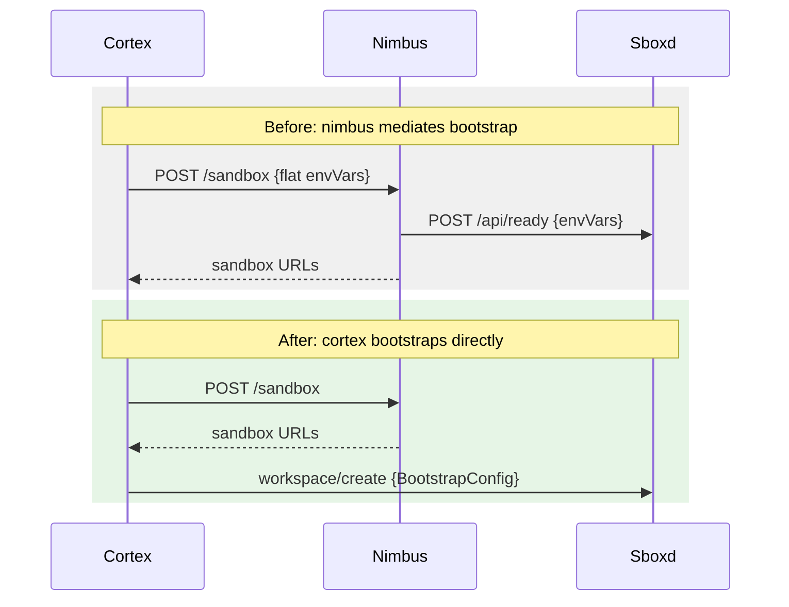

# Walkthrough Generator

Generate a narrative walkthrough of code changes, rendered as an HTML document with
side-by-side difftastic diffs. Every change chunk must be referenced in the walkthrough,
ensuring complete coverage. The narrative goes through an adversarial review loop to
ensure accuracy and clarity.

## Arguments

Parse `$ARGUMENTS` to determine the diff source and output path:

- **No args**: working tree changes (`git diff`)
- `staged` or `--cached`: staged changes (`git diff --cached`)
- A commit SHA (e.g. `abc123`): that commit (`git diff abc123~1 abc123`)
- A range `A..B`: that range (`git diff A..B`)
- `HEAD~N`: last N commits (`git diff HEAD~N HEAD`)
- `--output <path>`: output path for the walkthrough markdown (default: `walkthrough-{timestamp}.md`)

Derive two values from this:
- `DIFF_ARGS`: the arguments to pass after `git diff` (e.g. `--cached`, `HEAD~1 HEAD`, etc.)
- `OUTPUT_PATH`: where to write the walkthrough markdown

## Step 1: Check prerequisites

Run `which difft`. If not found, ask the user if they want to install via `brew install difftastic`.
If they decline, stop with: "difft is required for walkthrough generation."

Verify the version supports JSON output (0.67.0+): `difft --version`.

Run `which walkthrough`. If not found, install it:
```bash
cargo install --path ~/Documents/walkthrough
```

## Step 2: Collect diffs

Run the collect command:
```bash
walkthrough collect -o .walkthrough_data/ -- $DIFF_ARGS
```

This produces JSON files for the renderer and a `SUMMARY.md` in the data directory.

**Do not read the JSON files.** They contain machine-readable token spans meant for the
renderer.

## Step 3: Read the summary and plan

Copy `.walkthrough_data/SUMMARY.md` to `OUTPUT_PATH`:
```bash
cp .walkthrough_data/SUMMARY.md "$OUTPUT_PATH"
```

Read `OUTPUT_PATH`. It is already a valid walkthrough markdown file with difft code blocks
containing text diffs for every file and chunk. Each block has the correct `chunks=` spec
and the text diff body shows exactly what changed. HTML comments note chunk indices and
new-file line ranges.

Plan how to reorganize this into a narrative. Group by theme, not by file:

- **Core logic changes**: chunks with substantive behavior changes. Lead with these.
- **New modules/files**: introduce new concepts early, before their usage sites.
- **Refactoring/renames**: mechanical changes grouped together.
- **Import/config updates**: boilerplate changes, put these last.
- **Test changes**: group test updates near the code they test, or in a separate section.

If a chunk contains multiple logical changes, use `lines=START-END` to split it.

## Step 4: Write the walkthrough narrative

Edit `OUTPUT_PATH` to restructure the summary into a narrative. The difft code blocks are
already there, so focus on:

- Replace the `TODO` title and overview
- Reorganize sections by theme (move, merge, or split difft blocks as needed)
- Add prose before each difft block explaining what the diff shows and why
- Number the sections

### Code block rules

1. **Every code block** that references diffs uses the info string format:
   `difft <file-path> chunks=<spec>` where spec is comma-separated indices or `all`.
   Optionally add `lines=START-END` (1-based, inclusive) to show only a portion of the
   chunk. This is useful for splitting a large chunk (e.g. two new functions in one chunk)
   across multiple sections with prose in between.

2. **The block body** will be populated by the render step with a unified-diff-style text
   representation (` ` context, `-` removed, `+` added). You do not need to reconstruct
   code manually from the JSON.

3. **Group by narrative**, not by file. A single section can reference chunks from multiple
   files. A single file's chunks can appear across multiple sections.

4. **The same file can appear multiple times** in different sections with different chunk
   selections.

5. Use `chunks=all` for new files, deleted files, or files with only one or two chunks.

### Service badges

Use `` `@service-name` `` in inline code to render service names as styled badges
(orange text, light background, heavier font weight). This makes services stand out
from regular code references in the prose.

Examples:
- `` `@sboxd` `` renders as a badge for the sboxd service
- `` `@cortex` `` renders as a badge for cortex
- `` `@nimbus` `` renders as a badge for nimbus

Use service badges for:
- Service/process names (`@sboxd`, `@cortex`, `@nimbus`)
- Infrastructure components (`@ugit`, `@foundry`)
- External systems the code interacts with

Do NOT use for:
- Type names, function names, or field names (use regular `` `code` `` for those)
- Feature flag names (use regular `` `code` ``)

### Mermaid diagrams

Use `` ```mermaid `` code blocks to add diagrams that visually explain the change. The
renderer pre-renders them to inline SVG via `mmdc` (no JavaScript dependency in the HTML).

**Diagrams should show high-level architecture, not restate code.** A diagram that mirrors
an if/else branch from the diff adds no value. Instead, diagrams should help the reader
understand the system-level context that the code operates in.

The most effective pattern is **before/after sequence diagrams** that show how the
interaction between services changes. Place one in the overview section to orient the
reader before they see any code:

````markdown

````

Other useful diagram types:

- **Sequence diagrams** for request flows, RPC call chains, or multi-step processes
- **Class diagrams** for type relationships when new types are introduced

**Do NOT use:**
- **Flowcharts** that restate branching logic already visible in the diff (if/else,
  feature flag checks, guard conditions). The code is the source of truth for control
  flow; a flowchart just adds a less precise duplicate.

Place diagrams near the top of the walkthrough to orient the reader before the diff
details. Keep them simple (5-10 nodes max). If `mmdc` is not installed, the renderer
falls back to showing the mermaid source in a code block.

### Prose style

6. **Lead with WHY, not WHAT.** The diff shows what changed. The prose should explain the
   motivation, the constraint that forced this design, or the problem it solves. A reader
   should understand the reasoning before seeing the code. Bad: "This adds a `timeout`
   parameter." Good: "WebSocket connections can hang indefinitely if sboxd is unresponsive,
   so we add a 30-second timeout."

7. **Be concrete and specific.** Replace vague descriptions with exact names, values, and
   relationships. Bad: "This updates the config." Good: "This adds `bootstrap?: BootstrapConfig`
   to the `WorkspaceCreateRequest` wire type, so the TS client can send structured bootstrap
   data over WebSocket." Reference function names, type names, and field names by their actual
   identifiers.

8. **Explain terms inline, not upfront.** Do not create a glossary or "key terms" section.
   Instead, define domain-specific terms, service names, and jargon the first time they
   naturally appear in the narrative. Anchor explanations with concrete use-cases or examples
   when possible (e.g. "a **sandbox** is an isolated container where user code runs; each
   Figma file gets its own"). Assume the reader may be unfamiliar with the codebase.

9. **Interleave prose and diffs.** When a section has multiple diffs, place explanatory text
   between them rather than grouping all prose at the top and all diffs at the bottom. Each
   diff block should be immediately preceded by the prose that explains it.

10. **Use present tense.** "This extracts..." not "This extracted...". The walkthrough
    describes the change as it exists now.

11. **Keep it tight.** One to three sentences per diff block is usually enough. If you need
    more, the section should probably be split. Avoid restating what the diff already shows
    (e.g. don't list every field that was added if the diff is self-evident). Focus on the
    non-obvious: why this approach, what trade-off was made, what edge case it handles.

12. **Connect sections.** Brief transitions help the reader follow the thread. "With the
    types in place, the client can now..." is better than an abrupt jump to the next section.

13. **Title and overview matter.** The title should be a concise summary of the change
    (not a file name). The overview paragraph should give enough context that someone can
    decide whether to read the full walkthrough.

## Step 5: Render and enrich

Run the render command:
```bash
walkthrough render "$OUTPUT_PATH" --data-dir .walkthrough_data/ -o "${OUTPUT_PATH%.md}.html"
```

This does three things:
1. Produces the HTML file with side-by-side diffs
2. Writes text diff representations back into each difft code block in the markdown file
3. Verifies coverage and adds a badge below the title showing whether all chunks are covered

If the render output reports uncovered chunks, add sections referencing them and re-render.

## Step 6: Review loop

The review loop ensures the narrative is accurate, complete, and clear. Spawn two reviewer
agents in parallel. Each reads the rendered markdown (with enriched diffs) and produces a
verdict. The loop continues until both reviewers pass.

**Budget:** Maximum 3 review iterations. If reviewers are still failing after 3 rounds,
present the current state to the user and ask whether to continue or stop.

### Reviewer 1: Adversary

Spawns an agent (subagent_type: general-purpose, model: sonnet) with this prompt:

```
You are an adversarial reviewer for a code walkthrough. Read the walkthrough
markdown file at {OUTPUT_PATH}.

The file contains prose sections interleaved with difft code blocks. Each code
block shows the actual diff (` ` context, `-` removed, `+` added lines). Your
job is to verify the prose accurately describes the diffs.

Check each section for:

1. **Prose/diff mismatch** — the prose claims something the diff doesn't show,
   or misses something significant the diff does show. Read the diff line by
   line and compare against the prose description.

2. **Inaccurate descriptions** — wrong function names, wrong field names, wrong
   direction of change (says "adds" when the diff removes), wrong file
   referenced.

3. **Missing context** — the prose doesn't explain WHY a change was made, only
   WHAT changed. The reader should understand the motivation.

4. **Vague language** — handwavy descriptions where the diff has specific
   details. "Updates the config" when the diff shows exactly which fields were
   added.

5. **Ordering issues** — a section references concepts or types that haven't
   been introduced yet. The narrative should flow so each section builds on
   what came before.

6. **Overclaiming** — prose that states implications or consequences not evident
   from the code (e.g. "this improves performance" when the diff just
   restructures code).

Write your findings as a numbered list. For each issue, cite the section number,
the specific prose, and what the diff actually shows.

End with a verdict:
- PASS — no issues found
- FAIL — {N} issues need to be addressed

Output ONLY the review, no preamble.
```

### Reviewer 2: Open Questions

Spawns an agent (subagent_type: general-purpose, model: sonnet) with this prompt:

```
You are a completeness reviewer for a code walkthrough. Read the walkthrough
markdown file at {OUTPUT_PATH}.

The file contains prose sections interleaved with difft code blocks. Each code
block has a `chunks=` spec referencing specific diff chunks for a file. Your job
is to identify gaps and unanswered questions a reader would have.

Check for:

1. **Unexplained design decisions** — the code makes a choice (e.g. a specific
   timeout value, a particular data structure, a feature flag name) but the
   prose doesn't explain why.

2. **Missing error handling context** — the diff shows error handling, retries,
   or fallbacks but the prose doesn't explain what failures they guard against.

3. **Unclear scope** — the reader can't tell what's in vs out of scope for this
   change. Are there follow-up changes expected? Does this replace something?

4. **Undefined terms** — domain-specific jargon, service names, or acronyms
   used without explanation on first appearance.

5. **Missing connections** — chunks from different files that are related but
   the prose doesn't explain how they connect (e.g. a type definition in one
   file used by a function in another).

6. **Reader confusion points** — places where a reader unfamiliar with the
   codebase would be lost. Ask yourself: "If I didn't know this codebase,
   would I understand what this section is telling me?"

Write your findings as a numbered list. For each issue, cite the section and
explain what question remains unanswered.

End with a verdict:
- PASS — no significant gaps
- FAIL — {N} issues need to be addressed

Output ONLY the review, no preamble.
```

### Processing review results

After both reviewers complete:

1. If **both PASS**: proceed to Step 7.
2. If **either FAIL**: read their findings. Edit the narrative prose in
   `OUTPUT_PATH` to address the issues (do NOT edit code block bodies, they get
   repopulated). Re-run the render command, then re-spawn both reviewers on the
   updated file. Increment the iteration counter.
3. After **3 iterations** without both passing: present the remaining issues to
   the user and ask whether to continue iterating or accept the current state.

## Step 7: Present

Open the HTML file:
```bash
open "${OUTPUT_PATH%.md}.html"
```

Print a summary:
- Number of files covered
- Number of chunks covered
- Review iterations completed
- Output file path

If the user asks to publish, run:
```bash
walkthrough publish "${OUTPUT_PATH%.md}.html"
```
